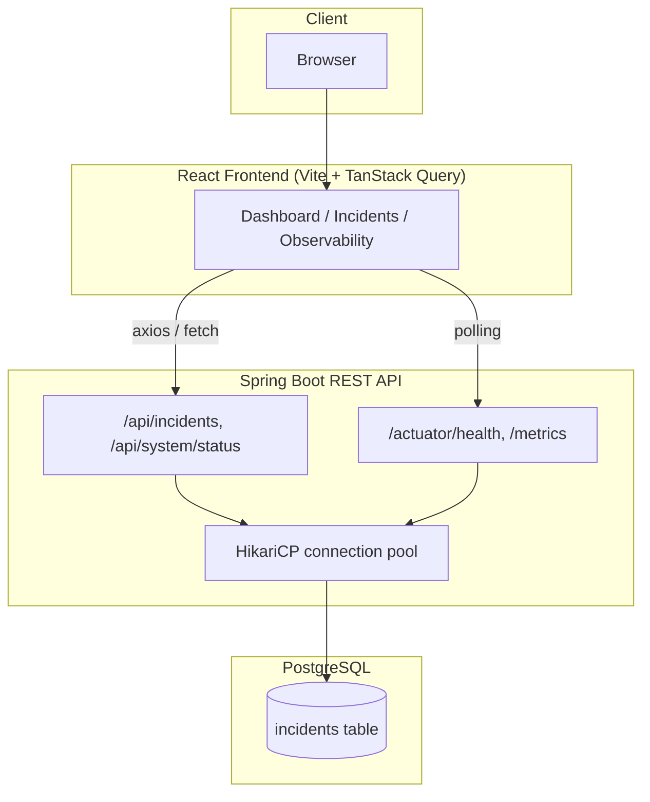
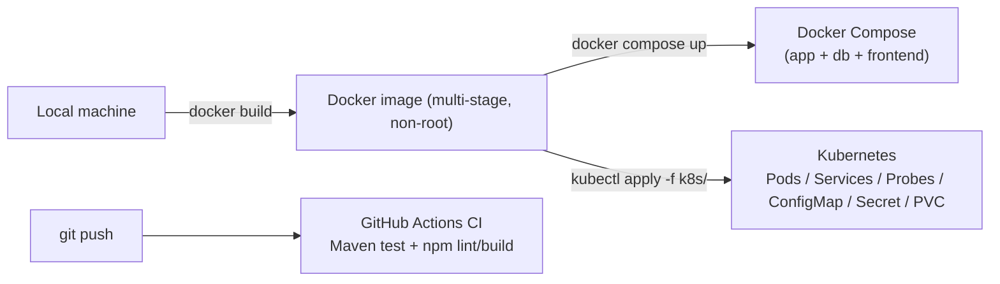

# OpsPilot AI

An operations/incident-management platform built as a hands-on demonstration of production
engineering practices: a Spring Boot REST API backed by PostgreSQL, a React operations console,
containerized with Docker, deployed to Kubernetes with health probes and persistent storage, and
validated on every push by GitHub Actions CI.

## Why this project exists

OpsPilot isn't trying to be a novel product — it's a deliberately realistic slice of the kind of
system an on-call engineer actually operates: an API with a real database, a UI that surfaces
incidents, and the operational scaffolding around both (health checks, connection pooling,
externalized config, container orchestration, CI) that separates a toy CRUD app from something
you could hand to a production support team. Each engineering decision in this repo was made and
documented deliberately, not copy-pasted — see [`docs/architecture.md`](docs/architecture.md) for
the reasoning behind each one.

## Main features

- **Incident lifecycle management** — create, list (filtered/paginated), view, and transition
  incidents through `OPEN → IN_PROGRESS → RESOLVED → CLOSED`, with server-side transition
  validation and aggregate stats (open/critical/trend).
- **React operations console** — a dashboard, incident table, and a live **Observability page**
  that surfaces real backend health and JVM/database metrics (not mocked data).
- **Spring Boot Actuator integration** — health groups (`readiness`, `liveness`, a curated
  `dashboard` group), Micrometer metrics, HikariCP connection-pool visibility.
- **Externalized, profile-based configuration** — `dev`/`prod` Spring profiles, all
  environment-specific values (DB connection, CORS origin, log verbosity) driven by environment
  variables, never hardcoded.
- **Kubernetes-native deployment** — Namespace, Deployments, Services, a ConfigMap, a Secret
  pattern, readiness/liveness probes, and a PersistentVolumeClaim for PostgreSQL, all runnable
  locally against Docker Desktop's built-in Kubernetes.
- **CI on every push/PR** — GitHub Actions runs the full backend test suite (with Testcontainers,
  not mocks) and the frontend lint/build.

## Architecture





## Technology stack

| Layer | Technology |
|---|---|
| Backend | Java 21, Spring Boot 4.1 (Web, Data JPA, Validation, Actuator), Flyway, HikariCP |
| Database | PostgreSQL 17 |
| Frontend | React 19, TypeScript, Vite, TanStack Query, Tailwind CSS, Axios |
| Testing | JUnit 5, Mockito, AssertJ, Testcontainers (real Postgres, not mocks) |
| Containers | Docker (multi-stage builds), Docker Compose |
| Orchestration | Kubernetes (Deployments, Services, ConfigMap, Secret, PVC, probes) |
| CI | GitHub Actions |

## Repository structure

```
opspilot-ai/
├── src/main/java/com/pushpendra/opspilot/   # Spring Boot backend
│   ├── controller/    # REST endpoints
│   ├── service/       # business logic
│   ├── repository/    # Spring Data JPA
│   ├── model/          # JPA entities
│   ├── dto/            # request/response records
│   ├── config/         # CORS, OpenAPI config
│   └── exception/      # centralized error handling
├── src/main/resources/
│   ├── application.properties        # shared config (profile-agnostic)
│   ├── application-dev.properties    # local dev defaults
│   ├── application-prod.properties   # prod: no credential defaults
│   └── db/migration/                 # Flyway SQL migrations
├── src/test/java/...                 # unit + Testcontainers integration tests
├── frontend/                         # React + TypeScript operations console
│   └── src/{pages,components,api,hooks,lib,types}/
├── k8s/                               # Kubernetes manifests (see below)
├── docs/                              # engineering documentation
├── .github/workflows/ci.yml          # CI pipeline
├── Dockerfile                         # backend image (multi-stage)
├── frontend/Dockerfile               # frontend image (Nginx)
├── docker-compose.yml                # local full-stack orchestration
└── .env.example                      # template for local secrets (no real values)
```

## Local setup

Prerequisites: Java 21, PostgreSQL running locally (or use Docker — see below), Node.js ≥20.19.

```bash
git clone git@github.com:Pushpendra15899/opspilot-ai.git
cd opspilot-ai

# Backend (dev profile is the default; safe local defaults apply)
./mvnw spring-boot:run

# Frontend, in a separate terminal
cd frontend
npm ci
npm run dev   # http://localhost:5173, proxies /api and /actuator to :8080
```

The `dev` profile ships with a working local default (`DB_USERNAME` matching a local trust-auth
Postgres role); override `DB_URL`/`DB_USERNAME`/`DB_PASSWORD` via environment variables if your
setup differs.

## Docker setup

```bash
cp .env.example .env      # fill in a real POSTGRES_PASSWORD - never commit this file
docker compose up --build
```

This starts three containers: `db` (Postgres 17, healthchecked), `app` (Spring Boot, `prod`
profile, waits for `db` to be healthy), and `frontend` (Nginx, waits for `app` to be healthy).
The backend image declares a Docker `HEALTHCHECK` against `/actuator/health`; Compose uses it to
gate the frontend's startup on the backend actually being ready, not just started.

- Frontend: http://localhost:3000
- Backend API: http://localhost:8080/api/incidents
- Backend health: http://localhost:8080/actuator/health

`docker-compose.yml` requires `POSTGRES_PASSWORD` to be set (via `.env` or the shell environment)
and will refuse to start otherwise — there is no hardcoded fallback password.

## Kubernetes setup

Manifests live in [`k8s/`](k8s/), applied in order against any local cluster (tested against
Docker Desktop's built-in Kubernetes):

```bash
kubectl apply -f k8s/00-namespace.yaml
kubectl apply -f k8s/01-configmap.yaml
# create the real Secret (see k8s/02-secret.example.yaml for the exact command -
# it's intentionally not a file you `kubectl apply`, so no credential ever touches disk)
kubectl create secret generic opspilot-db-credentials -n opspilot \
  --from-literal=DB_USERNAME=opspilot \
  --from-literal=DB_PASSWORD="$(openssl rand -base64 18)"
kubectl apply -f k8s/03-db.yaml
kubectl apply -f k8s/04-app.yaml

kubectl port-forward -n opspilot svc/opspilot-app 8080:8080
```

Then the backend is reachable at `http://localhost:8080` exactly as in Docker Compose. See
[`docs/deployment.md`](docs/deployment.md) for what each manifest demonstrates and why.

## API overview

| Method | Endpoint | Description |
|---|---|---|
| `POST` | `/api/incidents` | Create an incident |
| `GET` | `/api/incidents` | List incidents (filter by `status`/`severity`/`service`, paginated) |
| `GET` | `/api/incidents/{id}` | Get a single incident |
| `GET` | `/api/incidents/stats` | Aggregate counts + 14-day trend |
| `PATCH` | `/api/incidents/{id}/status` | Transition status (validated state machine) |
| `GET` | `/api/system/status` | App name, status, active environment (dev/prod), Java version |
| `GET` | `/api/health` | Simple text health string |

Full interactive documentation (OpenAPI/Swagger) is available at `/swagger-ui.html` when the
backend is running.

## Observability

The **Observability** page in the frontend (`/observability`) shows real, live data pulled from
Spring Boot Actuator — never mocked:

- Overall health (`/actuator/health`), database health specifically
  (`/actuator/health/dashboard` — see below), environment (dev/prod)
- HikariCP pool: active / idle / max / pending connections, and acquisition timeouts
- JVM: heap + non-heap memory, live/daemon thread counts, loaded classes, uptime, CPU usage
- Host/traffic signals: disk free space, GC pause count, log event counts

**Why a separate `/actuator/health/dashboard` group exists**: the root `/actuator/health`
endpoint intentionally hides per-component detail in the `prod` profile
(`show-details=when-authorized`) since this app has no authentication layer — "authorized" can
never be true, so that setting effectively means "never show detail to anyone." Rather than
reverting that hardening globally, a narrow `dashboard` health group exposes just `db` and
`diskSpace` detail (product name, byte counts — never credentials or connection strings) at its
own sub-path, purely for this UI.

## Health, readiness, and liveness probes

Kubernetes probes are wired to distinct Actuator health groups, not the same endpoint:

- **Readiness** (`/actuator/health/readiness`) includes the database check. If Postgres becomes
  unreachable, the pod is marked `NotReady` and Kubernetes removes it from the Service's
  endpoints — traffic stops routing to it — **without killing the container**.
- **Liveness** (`/actuator/health/liveness`) deliberately excludes the database. A database outage
  should not cause Kubernetes to restart the app container on top of the outage; restarting
  wouldn't fix a downstream Postgres problem and would just add churn.

This split was validated live: stopping the database pod flips readiness to `DOWN` within seconds
(pod removed from load balancing, zero restarts) while liveness stays `UP`; restoring the database
flips readiness back automatically.

## Database persistence

PostgreSQL's data directory is backed by a `PersistentVolumeClaim` (`k8s/03-db.yaml`), not
`emptyDir`. This was validated by deliberately deleting the running Postgres pod: Kubernetes
recreated it, reattached the same `PersistentVolumeClaim`, and all data — including a manually
created test incident — was still there. Earlier in this project's development, the same test
against an `emptyDir`-backed pod proved the opposite: all data was lost on pod recreation. See
[`docs/architecture.md`](docs/architecture.md#why-postgresql-persistence-matters) for the full
before/after.

## Secrets management

No real credential is committed anywhere in this repository:

- **Local dev**: a non-sensitive default username only (matches a local trust-auth Postgres role);
  password has no default and is empty/trust-auth by default.
- **`prod` profile**: zero credential defaults — the app fails fast on startup if `DB_URL` /
  `DB_USERNAME` / `DB_PASSWORD` aren't supplied as real environment variables.
- **Docker Compose**: requires `POSTGRES_PASSWORD` via an untracked `.env` file (see
  `.env.example`) or the shell environment; refuses to start without it.
- **Kubernetes**: a real `Secret` object, created imperatively (`kubectl create secret ...`, shown
  above) so no value is ever written to a file in the repo. `k8s/02-secret.example.yaml` is a
  placeholder-only template (`changeme`) documenting the shape.

**Path to production secret management**: every secret already flows in purely through
environment variables, so swapping the source requires no application code changes — an AWS ECS
task definition could inject credentials from **AWS Secrets Manager**, and an EKS Deployment could
source the same variables from a Kubernetes `Secret` populated by the **AWS Secrets Manager CSI
driver** or **External Secrets Operator**, exactly as documented in
[`docs/aws-migration.md`](docs/aws-migration.md).

## CI/CD

`.github/workflows/ci.yml` runs on every push to `main` and every pull request, with two
independent jobs:

- **Backend**: JDK 21, `./mvnw -B test` — the full suite, including a Testcontainers-backed
  integration test that boots a real ephemeral Postgres (no mocked database).
- **Frontend**: Node 22, `npm ci`, `npm run lint`, `npm run build` (build includes TypeScript
  validation via `tsc -b`).

No secrets are hardcoded in the workflow — Testcontainers provisions its own throwaway database
per run.

## Testing

- **Backend**: 23 tests — pure unit tests (Mockito) for service logic, `@WebMvcTest` slice tests
  for controllers, and a Testcontainers-backed `@SpringBootTest` that boots a real PostgreSQL
  container, runs actual Flyway migrations against it, and validates Actuator health/info/metrics
  endpoints end-to-end.
- **Frontend**: `oxlint` for linting, `tsc -b` for type-checking (part of the build step) — no
  component test suite yet (see Future Improvements).

Run locally: `./mvnw test` and `cd frontend && npm run lint && npm run build`.

## Troubleshooting

Common issues and their fixes are in [`docs/troubleshooting.md`](docs/troubleshooting.md),
including a real CORS 403 bug this project hit and fixed (frontend dev server origin not in the
backend's allowed-origins list) and a real stale-image bug (`imagePullPolicy: IfNotPresent`
serving a cached image after a rebuild).

## Production-readiness considerations

What's already in place: externalized config, profile separation, non-root containers, health
probes wired to meaningful dependency checks, connection-pool sizing made explicit and observable,
CI validation, and a documented secrets path.

What a real production deployment would still need, beyond what's in scope here: authentication
and authorization (there is currently none — see Future Improvements), TLS termination, rate
limiting, structured log shipping to a central store, alerting on the metrics already exposed, and
the managed-infrastructure swaps described below.

## AWS migration path

**OpsPilot is not deployed to AWS.** No AWS resources have been created, and nothing in this
repository has AWS credentials or connects to AWS. The application was designed with an AWS
deployment path in mind — every configuration value is already environment-variable driven
specifically so this migration requires no application code changes, only infrastructure and
config. See [`docs/aws-migration.md`](docs/aws-migration.md) for the detailed reasoning.

**Current (this repository, verified working):**
- Local Docker / Docker Compose
- Local Kubernetes (Docker Desktop)
- GitHub Actions CI
- Self-hosted PostgreSQL (container)
- Spring Boot Actuator for health/metrics

**Future (documented, not implemented):**
- **ECR** — container registry for the Docker images already built here
- **EKS** — managed Kubernetes, running the same manifests in `k8s/` with minimal changes
- **RDS PostgreSQL** — managed database, replacing the in-cluster Postgres Deployment
- **ALB** — Application Load Balancer in front of the EKS Ingress
- **VPC / IAM** — network isolation and least-privilege access (including IRSA for pod-level AWS
  permissions)
- **AWS Secrets Manager** — replacing the imperatively-created Kubernetes Secret
- **CloudWatch** — log and metrics aggregation
- **Optional Prometheus/Grafana** — for the metrics Actuator already exposes, if CloudWatch alone
  isn't sufficient

## Future improvements

- Authentication/authorization (currently none exists — the app is intentionally open for local
  demonstration purposes)
- Frontend component/integration test suite
- Prometheus + Grafana for long-term metrics retention and alerting (deliberately deferred, not
  forgotten)
- Multi-arch Docker builds (the current local image is `linux/arm64`; `linux/amd64` is needed for
  standard EKS node groups — see `docs/aws-migration.md`)
- The actual AWS deployment described above
